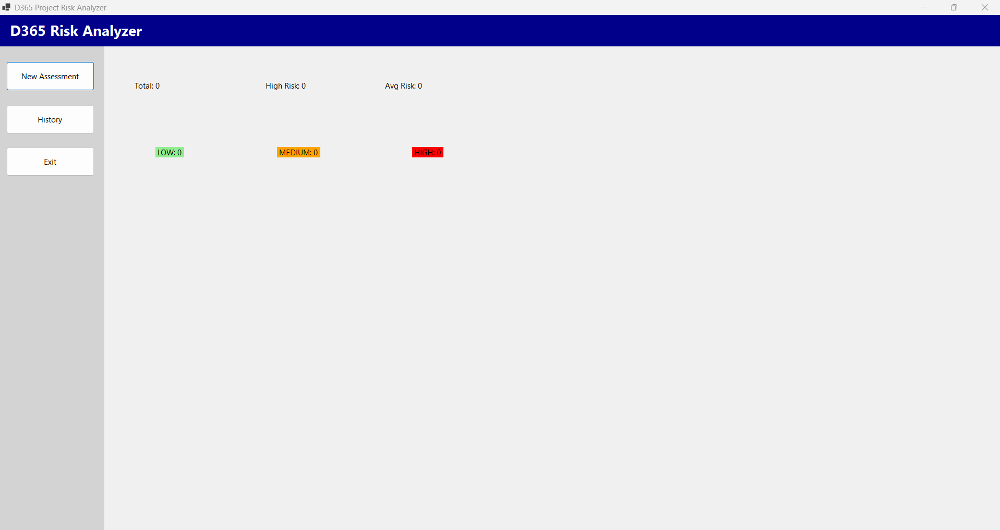
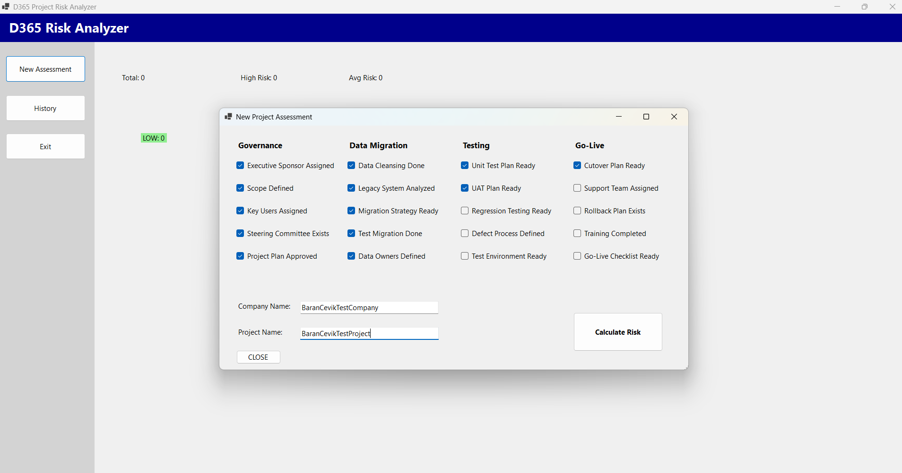
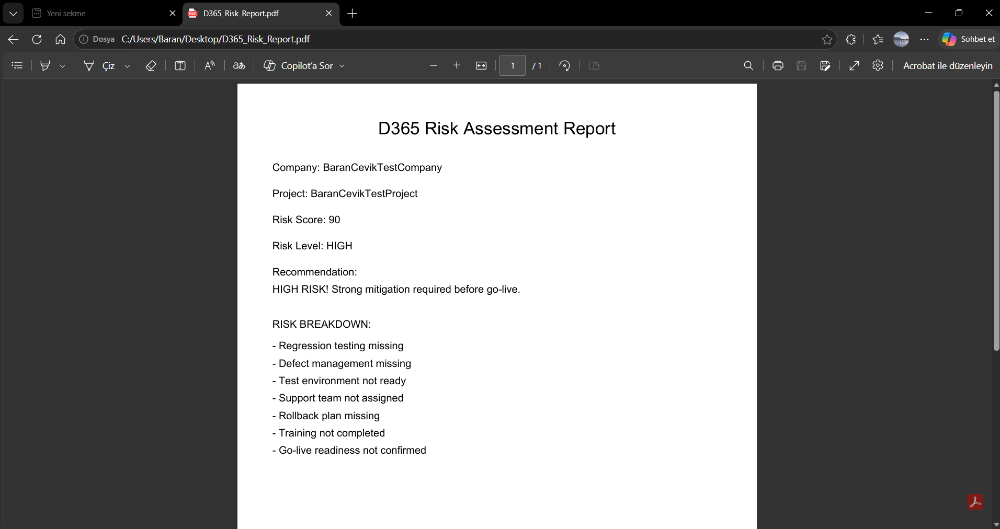

# D365 Risk Analyzer

## Overview

D365 Risk Analyzer is a desktop application designed to assess implementation risks in Microsoft Dynamics 365 ERP projects.

The application evaluates key project areas such as governance, data migration, testing, and go-live readiness, then generates a risk score and overall risk level to support project decision-making.

The goal is to provide early visibility into potential project risks and help project teams reduce implementation failures.

## Download & Run

Download the latest release from the [Releases](https://github.com/barancevik/D365-Risk-Analyzer/releases) page.

> **Note:** Windows SmartScreen may show a warning when running the application for the first time. Click "More info" and then "Run anyway" to proceed. This is expected behavior for open-source applications without a code signing certificate.

## Screenshots

## Features

* Risk assessment questionnaire
* 20 implementation risk criteria
* Automated risk scoring engine
* LOW / MEDIUM / HIGH risk classification
* SQLite database integration
* Assessment history management
* Record deletion functionality
* PDF report generation
* Detailed risk breakdown reporting
* Dashboard overview

## Technologies

* C#
* .NET
* Windows Forms
* ADO.NET
* SQLite
* PdfSharpCore

## Intended Users

* Dynamics 365 Consultants
* ERP Project Managers
* Digital Transformation Teams
* Business Analysts
* ERP Implementation Specialists

## Risk Categories

### Governance

* Executive Sponsor Assignment
* Scope Definition
* Key User Engagement
* Steering Committee
* Project Planning

### Data Migration

* Data Cleansing
* Legacy System Analysis
* Migration Planning
* Test Migration
* Data Ownership

### Testing

* Unit Testing
* User Acceptance Testing
* Regression Testing
* Defect Management
* Test Environment Readiness

### Go-Live Readiness

* Cutover Planning
* Support Readiness
* Rollback Strategy
* User Training
* Go-Live Approval

## Purpose

The purpose of this project is to identify implementation risks before they become critical issues and provide project teams with a structured risk assessment framework for Dynamics 365 ERP implementations.
